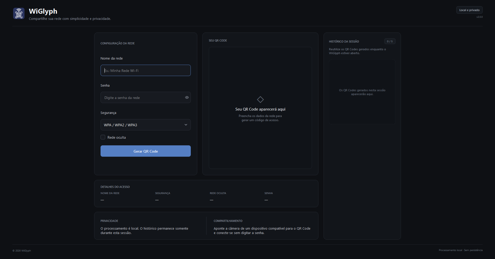

# WiGlyph

A private, cross-platform desktop application for sharing Wi-Fi access with QR codes.

WiGlyph generates standards-compatible Wi-Fi QR codes locally, allowing credentials to be shared without manually typing network names or passwords. The application is designed for a fast desktop workflow with no accounts, external services, telemetry, or permanent credential storage.

**English | [Português (Brasil)](README.pt-BR.md)**



## Features

- Generate Wi-Fi QR codes for WPA, WEP, and open networks
- Support for hidden networks
- Copy generated QR codes directly to the clipboard
- Export QR codes as PNG images
- Session-only history with up to five recently generated networks
- Restore previous QR codes from the current session
- Automatic invalidation of outdated QR codes when network settings change
- Fully local and offline processing
- Native desktop interface built with Qt
- Windows and Linux support

## Privacy

WiGlyph processes Wi-Fi credentials entirely on the local device.

The application does not:

- send credentials to external services;
- require an account or authentication;
- use analytics or telemetry;
- persist Wi-Fi passwords or network configuration between sessions.

The history is kept only in memory for the duration of the current application session. Closing WiGlyph clears it.

Generated QR codes inherently contain the Wi-Fi credentials required to connect to the network. Saved or copied QR codes should therefore be handled with the same care as the credentials themselves.

## Download

Prebuilt binaries are distributed through the GitHub Releases page.

### Windows

Download:

```text
WiGlyph-2.0.0-windows-x86_64-setup.exe
```

Run the installer normally. WiGlyph is installed for the current user and does not require administrator privileges.

### Linux

Download:

```text
WiGlyph-2.0.0-linux-x86_64.AppImage
```

Make the AppImage executable:

```bash
chmod +x WiGlyph-2.0.0-linux-x86_64.AppImage
```

Then run it:

```bash
./WiGlyph-2.0.0-linux-x86_64.AppImage
```

No system-wide Python or Qt installation is required for either distribution.

## Development

### Requirements

- Python 3.11 or newer
- Git

Clone the repository:

```bash
git clone https://github.com/arthurcfranklin/wiglyph.git
cd wiglyph
```

Create a virtual environment:

```bash
python -m venv .venv
```

Activate it on Linux:

```bash
source .venv/bin/activate
```

Or on Windows PowerShell:

```powershell
.venv\Scripts\Activate.ps1
```

Install the project with development and build dependencies:

```bash
python -m pip install --upgrade pip
python -m pip install -e ".[dev,build]"
```

Run WiGlyph from source:

```bash
python -m wiglyph
```

## Testing

Run the automated test suite:

```bash
python -m pytest -q
```

Validate Python syntax:

```bash
python -m compileall -q src tests packaging
```

## Building

WiGlyph uses PyInstaller to create standalone application bundles.

Build using the project specification:

```bash
python -m PyInstaller --clean --noconfirm WiGlyph.spec
```

### Windows

The Windows installer is built from the PyInstaller bundle using Inno Setup and the configuration located at:

```text
packaging/windows/WiGlyph.iss
```

### Linux

Linux releases are packaged as AppImages. The AppDir configuration is located in:

```text
packaging/linux/
```

The reproducible Linux build is automated through:

```text
.github/workflows/build-linux.yml
```

Release AppImages are built on the CI environment rather than on a rolling-release development system.

## Project Structure

```text
wiglyph/
├── .github/
│   ├── assets/
│   └── workflows/
├── assets/
│   └── icons/
├── packaging/
│   ├── linux/
│   ├── windows/
│   └── launcher.py
├── src/
│   └── wiglyph/
│       ├── core/
│       ├── ui/
│       └── utils/
├── tests/
├── pyproject.toml
├── README.md
└── WiGlyph.spec
```

## Technology

WiGlyph is built with:

- Python
- PySide6 / Qt 6
- qrcode
- Pillow
- PyInstaller
- AppImage
- Inno Setup

## Version

Current version: `2.0.0`
